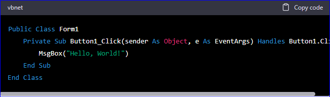

# Visual Basic (VB)
Public Visual Basis examples

Here's a common example of a simple Visual Basic (VB) program that displays a message box:  
```vb
Public Class Form1
    Private Sub Button1_Click(sender As Object, e As EventArgs) Handles Button1.Click
        MsgBox("Hello, World!")
    End Sub
End Class
```  

Generated with [ChatGPT Feb 13 Version](https://chat.openai.com/chat)  ```dated 2023-02-25```:  


In this example, we have a form (Form1) with a button (Button1) on it. When the button is clicked, it triggers the Button1_Click event, which displays a message box with the text "Hello, World!".

This is a very simple example, but it shows how to create a basic form with a button and how to handle button click events in VB. From here, you can build more complex applications by adding additional controls and event handlers, and incorporating more advanced programming concepts like loops, conditions, and object-oriented programming.


## Visual Basic for Applications (VBA)

* Repository for private [VBA examples](https://github.com/griemide/VBA) (reserved)  

## Visual Basic Scripting (VBS)

* Repository for private [VBS examples](https://github.com/griemide/VBA/tree/master/scripts) (reserved)

## References

### Categorization  
Source: [Wikipedia](https://en.wikipedia.org/wiki/Visual_Basic) ```dated 2023-02-25```  

Visual Basic is a name for a family of programming languages from Microsoft. It may refer to:  
* Visual Basic, the current version of Visual Basic launched in 2002 which runs on .NET  
* Visual Basic (classic), the original Visual Basic supported from 1991–2008  
* Embedded Visual Basic, the classic version geared toward embedded applications
* Visual Basic for Applications, an implementation of Visual Basic 6 built into programs such as Microsoft Office and used for writing macros
* VBScript, an Active Scripting language

### Difference between VB, VBA, and VBS  
Source: [ChatGPT Feb 13 Version](https://help.openai.com/en/articles/6825453-chatgpt-release-notes) ```dated 2023-02-25```  

VB, VBA, and VBS are all programming languages developed by Microsoft. Here are the differences:

* VB (Visual Basic) is a programming language used for developing Windows applications. It is an object-oriented language based on the BASIC language and is used in the Visual Studio development environment. It is a desktop application development language and is used to create standalone Windows applications.

* VBA (Visual Basic for Applications) is an advanced version of VB used in Microsoft Office applications such as Excel, Word, and Access. VBA allows users to create macros to automate repetitive tasks, and it also allows the creation of custom functions and forms within the Office applications.

* VBS (Visual Basic Script) is a scripting language used for automating Windows-based tasks. It is an interpreted language that is saved in script files and can be executed from the command prompt or another program. It is useful for automating tasks such as file operations, network connections, and process control.

In summary, VB is a desktop application development language, while VBA is used for automating tasks within Microsoft Office applications. VBS is mainly used for automating Windows tasks.


